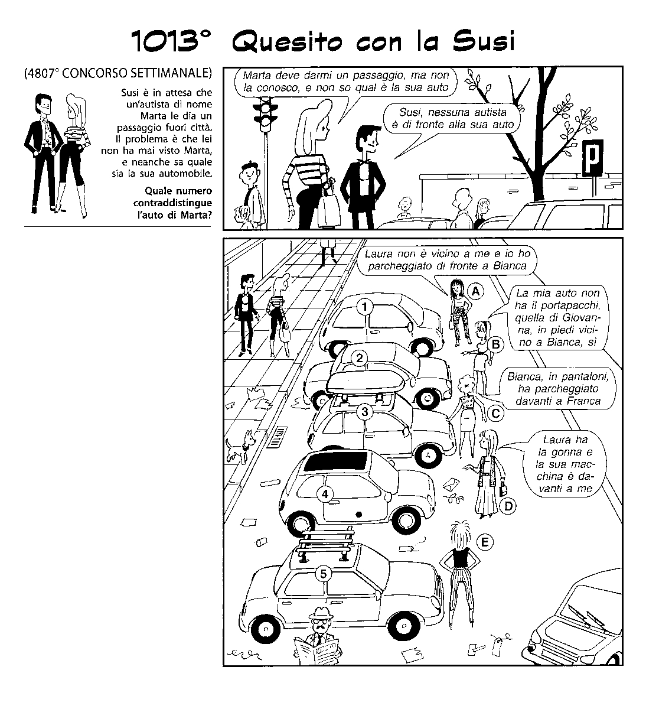

Partendo dal problema esposto dal quesito con la Susi, questo programma:
- definisce un modello del problema
- introduce i vincoli
- applica una logica combinatoria brute-force per trovare la soluzione (le soluzioni).

Il tutto funziona rapidamente in quanto il numero delle combinazioni possibili e' basso = 5! x 5! = 14400